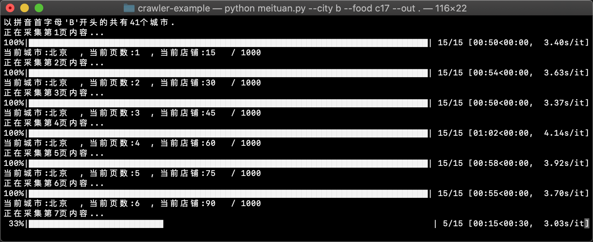

# 一些有趣的Python爬虫实例🐛
Some interesting python crawler example. 

#### 开始前
1. 确保安装所需库
`pip install -r requirements`
2. 确保稳定的网络连接

### Unsplash每日推荐美图🏞
- 名称: `unsplash.py`
- 用法: `python unsplash.py`
- 参数: 
```
--dst     -d   下载目录，默认当前目录
--width   -w   指定宽度像素，其高度自适应，默认1920px
--dpr     -p   设备像素比(1或2)，默认1
```
- 注意: 有时因为网络问题，会发生连接中断或长时间未响应

### 美团美食的店铺信息🍱
- 名称: `meituan.py`
- 用法: `python meituan.py`
- 参数:
```
--city    -c   所有符合此拼音首字母(A-Z)的城市，默认全部(*)
--food    -f   美食种类，默认全部(*)
--out     -o   将采集的信息以CSV格式保存至此目录，默认当前目录
```
- 注意:
```
--food 参数有以下美食种类:
蛋糕甜点(c11), 火锅(c17), 自助餐(c40), 小吃快餐(c36), 日韩料理(c28), 西餐(c35), 烧烤(c54), 东北菜(c20003), 川湘菜(c55), 江浙菜(c56), 粤菜(c57), 西北菜(c58), 咖啡酒吧(c41), 云贵菜(c60), 东南亚菜(c62), 海鲜(c63), 台湾、客家菜(c227), 粥(c229), 蒙菜(c232), 新疆菜(c233), 京鲁菜(c59)
--out  保存的CSV头部为:
name(店铺名称), avgScore(平均评分), avgPrice(平均消费), address(店铺地址), phone(店铺热线), openTime(营业时间), longitude(经度), latitude(维度), hasFoodSafeInfo(是否持有食品安全声明), (可选)recommended(推荐菜品)
```
- 效果:


### 知轩藏书查询下载📚
- 名称: `xiaoshuoGUI.py`
- 用法: `python xiaoshuoGUI.py`
- 注意:
```
下载方式为呼出默认浏览器, 进而呼出默认下载工具下载, 使用python传输会导致下载失败。
```
- 效果:

