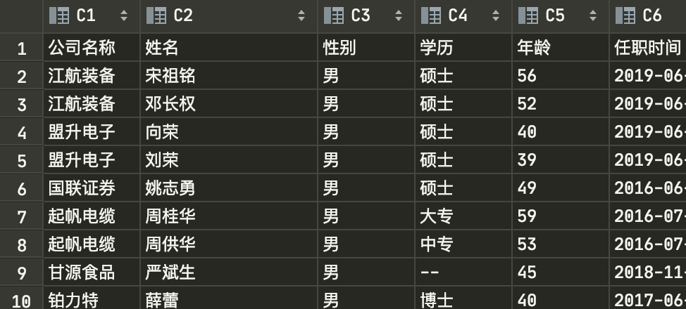

### 东方财富公司管理层信息💰
- 名称: `eastmoney.py`
- 用法:
  1. 安装谷歌浏览器
  2. 下载Chrome Driver, 版本为对应浏览器版本 [官方地址](http://chromedriver.storage.googleapis.com/index.html) | [淘宝镜像](http://npm.taobao.org/mirrors/chromedriver/)
  3. 更改 `eastmoney.py` 中的值:
     ```
     chrome_driver_path = '下载的chrome driver的路径'
     proxies = [HTTP/HTTPS代理IP地址列表]
     ```
  4. 启动脚本 `python eastmoney.py`
- 注意:
  - 偶尔刚启动时, 会报错 `元素定位失败` 或其他错误, 重启运行即可
  - 程序运行期间可能会出现 `元素失败` 的错误, 可运行 `collect` 函数中注释部分, 并改 `self.page` 的值为重新开始的位置
  - 获取管理层信息时使用的是 `requests`, 最好使用IP代理地址池, 以免被反爬
- 效果:
  - 爬取信息效果图:
  