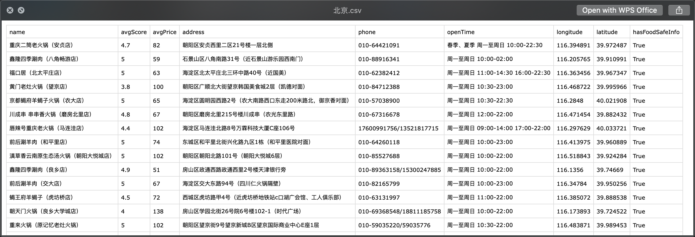

### 美团美食的店铺信息🍱
- 名称: `meituan.py`
- 用法: 
  ```
  python meituan.py                        # 获取所有城市所有美食数据
  python meituan.py --city z --food c54    # 获取所有以Z为拼音首字母城市的烧烤数据
  ```
- 参数:
  ```
  --city    -c   所有符合此拼音首字母(A-Z)的城市，默认全部(*)
  --food    -f   美食种类，默认全部(*)
  --out     -o   将采集的信息以CSV格式保存至此目录，默认当前目录
  ```
- 注意:
  ```
  美食种类包括: 蛋糕甜点(c11), 火锅(c17), 自助餐(c40), 小吃快餐(c36), 日韩料理(c28), 西餐(c35), 烧烤(c54), 东北菜(c20003), 川湘菜(c55), 江浙菜(c56), 粤菜(c57), 西北菜(c58), 咖啡酒吧(c41), 云贵菜(c60), 东南亚菜(c62), 海鲜(c63), 台湾、客家菜(c227), 粥(c229), 蒙菜(c232), 新疆菜(c233), 京鲁菜(c59)
  保存CSV头部: name(店铺名称), avgScore(平均评分), avgPrice(平均消费), address(店铺地址), phone(店铺热线), openTime(营业时间), longitude(经度), latitude(维度), hasFoodSafeInfo(是否持有食品安全声明), 【可选】recommended(推荐菜品)
  ```
- 效果: `python meituan.py --city b --food c17`

