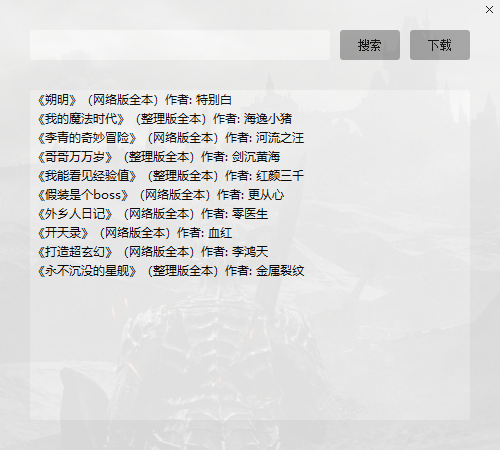

### 知轩藏书查询下载📚
- 名称: `ZXxiaoshuo.py`
- 用法: `python ZXxiaoshuo.py`
- 注意: 下载方式为默认浏览器的下载工具
- 效果:



### 笔趣阁小说下载📚
- 名称: `BQxiaoshuo.py`
- 用法: `python BQxiaoshuo.py`
  ```
  delay = 0         每章下载完后的延时，防止访问过快导致IP被封禁，默认为0(目前未遇到被封IP的情况)
  thread_nbr = 5    线程数，默认为5，如需提高下载速度请自行更改
  ```
- 注意: 
  - 采用多线程逐章下载，适用于在网络上找不到整本的小说下载。
  - 适用于www.biqugg.com及类似页面结构的小说网站